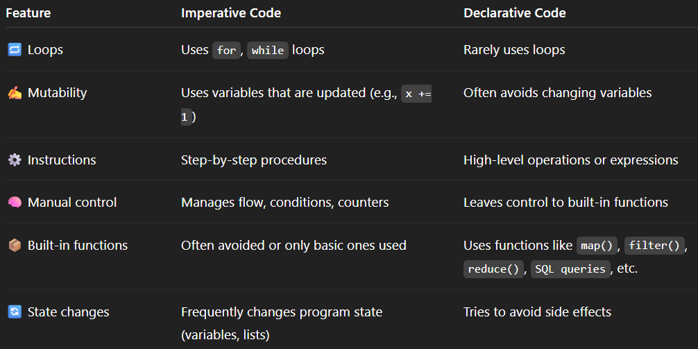

---
### Dynamic vs Static type

every variable has a type.

- python is dynamically typed ,i.e; the type of x is derived when x is assigned to something.
eg)x=10, x is int
- Java, C are all Statically typed - the type for x is initialized upfront in the program and will be used throughout as so. Not supposed to change it. eg) int x , float number. 
ILLEGAL int x = 7.5

Problem of Dynamic Typing

- wont be able to tell errors. here python just thinks factorlst is just another variable.
    
    ```jsx
    `def factors(n):
    factorlist = []
    for i in range(1, n+1):`
    
    `if n % i == 0:
    factorlst = factorlist + [i]  # Typo here!`
    ```
    
    `return(factorlist)` 
    
- when using user-defined data structures like linked lists… when we initialize     l=none; python dont know if its a list or node or etc until we provide more info.

### Scope and Lifetime of a variable

- scope of x means where all u can use this variable x in the program.
    - multiple x’s can be used in single pgm but all might be in different scopes.
- ***lifetime of a variable*** specifies the duration for which the computer allocates memory to it, from allocation to deallocation.

> Hole in Scope-
> 
> 
> ```python
> def f():
>     for x in [1, 2, 3]:
>         y = g(x)
>         # x is accessible here ✅
>     # here, x is not accessible ❌ (hole in scope — x is alive, but you can't access it)
> 
> ```
> 
---
### Memory Stack

- each fxn call leads to its **activation record** being pushed to the stack and popped out when execution is complete.
    - Control Link - points to prev activation rec eg) fac1→fact2→fac3.
    - Return Value Link - tells where to store the result.
    
    
    
    
    

### Passing Arguments to Function

- Call by Value:- values of the actual parameters are copied to the formal parameters(parameters of the function def)
    
    
    
- Call by Reference:- address of the values of the actual parameters are sent to the formal parameters and thereby allowing the fxn to change the values present at those addresses.


### Heap Memory

- outlives stack memory
- used when u donno how much mry u need eg) linked list or array , i.e dynamic memory situations
- manually removal (in C using malloc()/free() )or automatic heap storage removal(in java/ python by Garbage Collector frees unused heap mry using mark and sweep (not reachable))
    - *Memory Leak*  happens when the unused mry is not freed and persists in heap, leading to slower access of heap mry, hoarding up of unwanted data.eg) like a tap opened for use but never closed.

---

### Abstraction & Modularity

| Concept | What is hidden? | What is shown? | Example |
| --- | --- | --- | --- |
| **Control Abstraction** | Internal steps in flow control | The task you want to perform | `if`, `for`, `function()` |
| **Data Abstraction** | Internal data structure or layout | The operations you can do | `.push()`, `.append()`, `.pop()` |
---
### OOP

<aside>
💡

SIMULA - first OOP language created. Implemented using queue for each event.

</aside>

An object is an abstract datatype. it can be anything; consist of anything; stacks, queues, an integer, a memory location etc.

Features include:-

- Abstraction
- Subtyping:- a relationship b/w interfaces(check if types of various objects are statically same so that various implementations can be done)
    - If **A** is subtype of **B** then **A** is specialization of **B**
- Dynamic Lookup:- the choice of the method implementation is looked up and checked during run time only .
- Inheritance:- a relationship b/w implementations

eg)Stack and Queue are not subtypes of Deque as all implementations of Dequeue cannot be done on stack and queue.

Stack and Queue inherit from Deque(reuse its functions)

---

### Classes & Objects

- object are encapsuled with - data, operations.
- Class :- like a data type for each object. has  data and ways to show how data is manipulated.
    - objects of this class are like variables of the same data type. how the data in these variables get manipulated is performed by the functions present in the class.
---